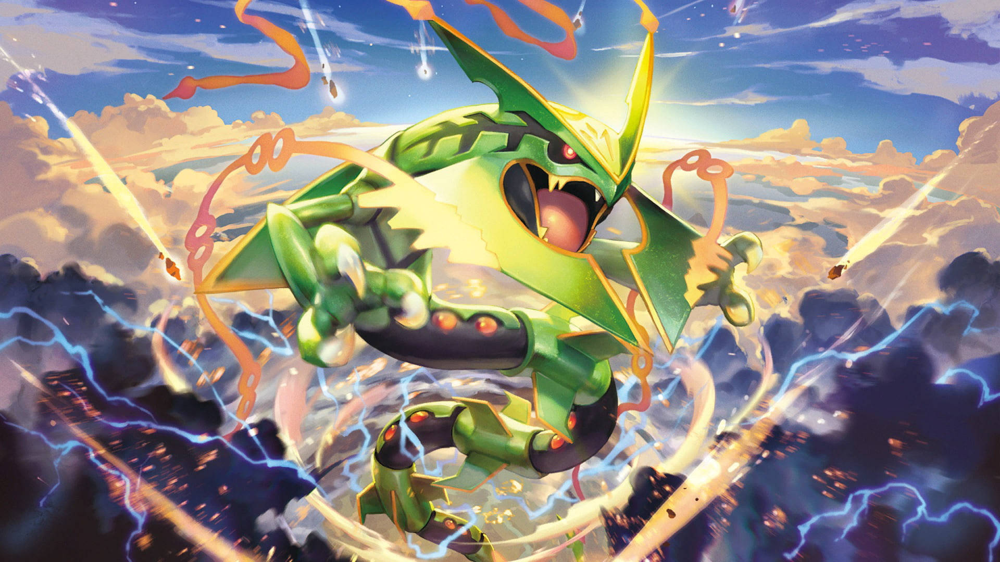

# Encabezado de nivel 1

## Encabezado de nivel 2

### Encabezado de nivel 3

#### Encabezado de nivel 4

##### Encabezado de nivel 5

###### Encabezado de nivel 6

<h1>Encabezado de nivel 1 HTML </h1>

Otro Encabezado de nivel 1
==========================

Otro encabezado de nivel 2
---------------------------

***

Este es mi primer parrafo.\
Este es mi segundo parrafo.

***

**Texto en negrita**

__Texto en negrita__

***

*Texto en italica*
_Texto en italica_

***Texto en negrita y en italica***

***

~~Texto tachado~~

E = MC^2^  
E = MC~1234~

***

> *En un lugar muy lejano*  
> *Lego stars wars*  
> ...

***

[Sitio web de la universidad de costa rica](Https://ucr.ac.cr)

[youtuve](https://youtuve.com)

***

***

***

imagen local

***

Imagen con tamaño modificado

